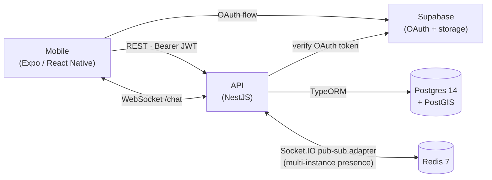

# LocalLoop

A proximity based groups and chat app — find people anchored to a place (a coffee shop, a neighborhood, a building, an event).

[](https://www.npmjs.com/package/@localloop/shared-types)
[](https://www.npmjs.com/package/@localloop/geo-utils)
[](https://github.com/Local-Loop-org/localloop-shared/actions/workflows/ci.yml)
[](https://github.com/Local-Loop-org/localloop-shared/actions/workflows/publish.yml)

> This repo holds the **shared TypeScript packages** (`@localloop/shared-types`, `@localloop/geo-utils`) and **all project documentation** (architecture, API contracts, data model, ADRs, status). It is also the recommended entry point for reading the project.

---

## What LocalLoop is

LocalLoop lets you discover and join groups anchored to a real-world location — an _establishment_, a _neighborhood_, a _condo_, or an _event_ — and chat with members in real time. Discovery uses geohash bucketing plus haversine distance, so groups appear sorted by how close their anchor is to you. Crucially, your coordinates never leave the API boundary: only your geohash is persisted, and the only distance ever exposed is **user → group anchor** — never **user → user** (a hard privacy invariant captured in [docs/architecture.md](docs/architecture.md)). Sign-in is OAuth-only (Google / Apple via Supabase), and chat runs over Socket.IO with a Redis pub-sub adapter so it scales horizontally.

## The three repos

| Repo | Stack | What it does |
| --- | --- | --- |
| [localloop-api](https://github.com/Local-Loop-org/localloop-api) | NestJS 10 · TypeORM · Postgres 14 + PostGIS · Redis 7 · Socket.IO | Auth, users, groups, geo discovery, real-time chat |
| [localloop-mobile](https://github.com/Local-Loop-org/localloop-mobile) | Expo SDK 55 · React Native 0.83 · React Query · Zustand · Axios | iOS/Android client; Android APK released via GitHub Actions |
| [localloop-shared](https://github.com/Local-Loop-org/localloop-shared) (this repo) | TypeScript · npm workspaces | `@localloop/*` packages + all docs and ADRs |

## Architecture at a glance



The mobile client owns its server-state cache via React Query and persists only the auth session in Zustand + SecureStore. The API is layered — every module follows `domain → application → infra → presentation` — and writes location as a 6-character geohash so coordinates never leave the boundary.

## Tech stack

| Layer | Choices |
| --- | --- |
| **Backend** | NestJS 10.4 · TypeORM 0.3 · `passport-jwt` · Socket.IO 4.7 · `@socket.io/redis-adapter` 8.3 · `class-validator` |
| **Mobile** | Expo SDK 55 · React Native 0.83 · React 19.2 · `@tanstack/react-query` 5 · Zustand 5 · React Navigation 7 · `react-native-svg` |
| **Shared (this repo)** | TypeScript 5.1 · npm workspaces |
| **Data & infra** | Postgres 14 + PostGIS 3.4 · Redis 7 · Supabase (OAuth + storage) · `ngeohash` |
| **Auth** | OAuth-only (Google + Apple via Supabase) · stateless JWT + refresh rotation |
| **Tooling** | Jest · React Native Testing Library · Supertest · ESLint · Prettier · Docker |

## What's in this repo

```
localloop-shared/
  packages/
    shared-types/    @localloop/shared-types — enums + interfaces shared by API and mobile
    geo-utils/       @localloop/geo-utils — geohash + haversine helpers
  docs/
    status.md            Living project status (read first to know what's in flight)
    done.md              Closed work archived out of status.md (full checklists for shipped slices)
    testing-backlog.md   All pending tests (API integration, mobile E2E, Maestro flows)
    backlog.md           Lower-priority work (Phase 5 polish, RQ migration tail, DevOps)
    history.md           Dated branch-level summaries (the older "Last updated" entries)
    architecture.md      Architecture, layering, privacy rules
    api-contracts.md     REST endpoints + WebSocket events
    data-model.md        Database schema + enum mapping
    prd.md               Product requirements
    decisions/           ADR trail (5 decisions logged)
```

Quick links into the docs: [status.md](docs/status.md) · [done.md](docs/done.md) · [testing-backlog.md](docs/testing-backlog.md) · [backlog.md](docs/backlog.md) · [architecture.md](docs/architecture.md) · [api-contracts.md](docs/api-contracts.md) · [data-model.md](docs/data-model.md) · [decisions/](docs/decisions/).

## Shared packages

### `@localloop/shared-types` (1.3.0)

Single source of type truth across both apps. Exports every enum used by the API DTOs and mobile screens (`Provider`, `DmPermission`, `AnchorType`, `GroupPrivacy`, `MemberRole`, `MemberStatus`, `MediaType`, `RequestStatus`) plus the cross-boundary interfaces `UserSummary`, `NearbyGroup`, and `PresenceUpdate`. Both the backend `UserSummaryDto` / `UserProfileDto` and the mobile `User` type `implements` / re-export `UserSummary`, so any drift between API responses and mobile expectations breaks at compile time.

See [packages/shared-types/src/index.ts](packages/shared-types/src/index.ts).

### `@localloop/geo-utils` (2.0.0)

Stateless geo helpers used on both sides:

- `coordinatesToGeohash(lat, lng, precision?)` — coordinate → geohash (default precision 6, ~1.2 km cells; rationale in [ADR 005](docs/decisions/005-geohash-precision-6.md)).
- `getNeighborCells(geohash)` — the 8 adjacent cells, used by the API to expand the search before haversine sort.
- `distanceMeters(lat1, lng1, lat2, lng2)` — haversine distance in meters.

See [packages/geo-utils/src/index.ts](packages/geo-utils/src/index.ts).

## How updates flow to npm

```
edit package → bump version in its package.json → merge to main
                                  │
                                  ▼
            .github/workflows/publish.yml runs:
            1. npm ci, npm run build (workspaces)
            2. for each package:
                 LOCAL_VERSION=$(node -p require('./package.json').version)
                 REMOTE_VERSION=$(npm view <pkg> version)
                 if same → skip with ::notice
                 else    → npm publish --provenance --access public
```

Both packages publish under the public `@localloop/*` scope. The remote-version check makes it safe to re-run main builds — only a real version bump triggers a publish. Workflow source: [.github/workflows/publish.yml](.github/workflows/publish.yml).

## Deployment

Three independent CI/CD pipelines, each gated on lint and tests:

| Repo | Pipeline | Output |
| --- | --- | --- |
| `localloop-api` | lint → unit + e2e tests (against real PostGIS + Redis service containers) → Docker image build → Render deploy webhook | API live on Render (Neon Postgres + Upstash Redis in prod) |
| `localloop-mobile` | type-check → unit tests → EAS Build (Android, profile `production`) → GitHub Release `build-<run_number>` with the `.apk` attached | Sideloadable APK from the repo's Releases page |
| `localloop-shared` | lint (type-check) → build → conditional `npm publish` per package | Versioned packages on npm |

## Highlights

- **End-to-end TypeScript with a shared types package** — backend DTOs and mobile types both implement / re-export `UserSummary`, so contract drift is a compile error, not a bug report.
- **Privacy-by-design** — coordinates are converted to a 6-char geohash on write and never round-trip; the API only ever exposes user → anchor distance, never user → user (no triangulation).
- **Geospatial discovery** — `getNeighborCells` expands the user's geohash to a 9-cell window, then haversine sorts results by precise meters.
- **Multi-instance-correct presence** — chat gateway emits `presence_update` from `server.in(room).fetchSockets()` via the Redis adapter, with a `setImmediate` deferral on disconnect so Socket.IO room cleanup completes before the count is read.
- **Optimistic mobile UX** — `useGroupChat` writes a `temp-` message into the React Query cache on send, and the server's `new_message` echo is reconciled by matching sender + content.
- **Token rotation that survives concurrent requests** — the axios `apiClient` has a single in-flight refresh + a queue of waiting requests, so a burst of 401s rotates the token exactly once.
- **Tested at the boundary** — API e2e tests run against real PostGIS + Redis service containers in CI, not mocks. Mobile tests cover the 401 refresh queue, optimistic chat, and screen integration with React Query.
- **ADR trail** — five decisions documented in [docs/decisions/](docs/decisions/) covering NestJS + TypeORM, PostgreSQL + PostGIS, Expo + React Native, Supabase auth, and the geohash precision choice.

## Status and roadmap

[docs/status.md](docs/status.md) is the living source of truth — what shipped, what's in flight, technical debt, and pending decisions. Read it first if you want to know where the project actually is.

## Local development

Each repo has its own quickstart:

- API: see [localloop-api/README.md](https://github.com/Local-Loop-org/localloop-api/blob/main/README.md)
- Mobile: see [localloop-mobile/README.md](https://github.com/Local-Loop-org/localloop-mobile/blob/main/README.md)
- Shared (this repo): `npm install` then `npm run build` builds both packages; `npm run lint` type-checks them.
